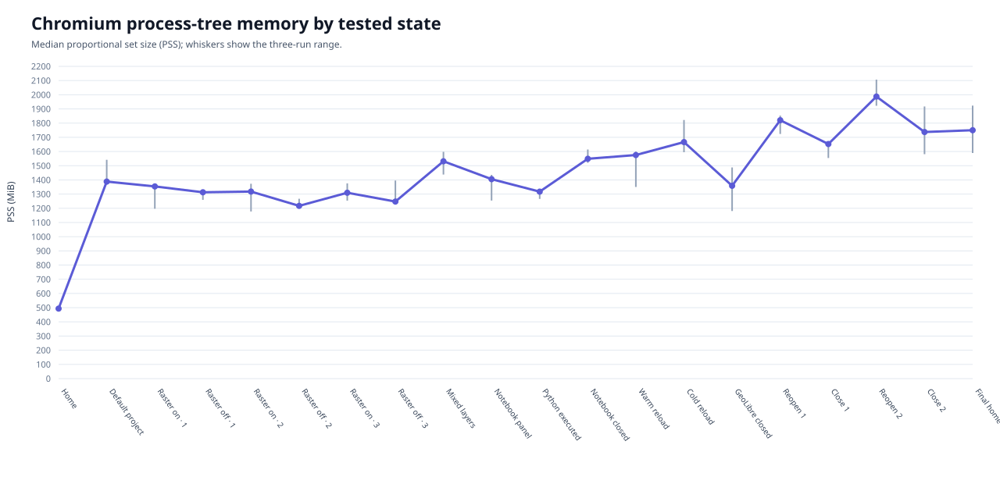
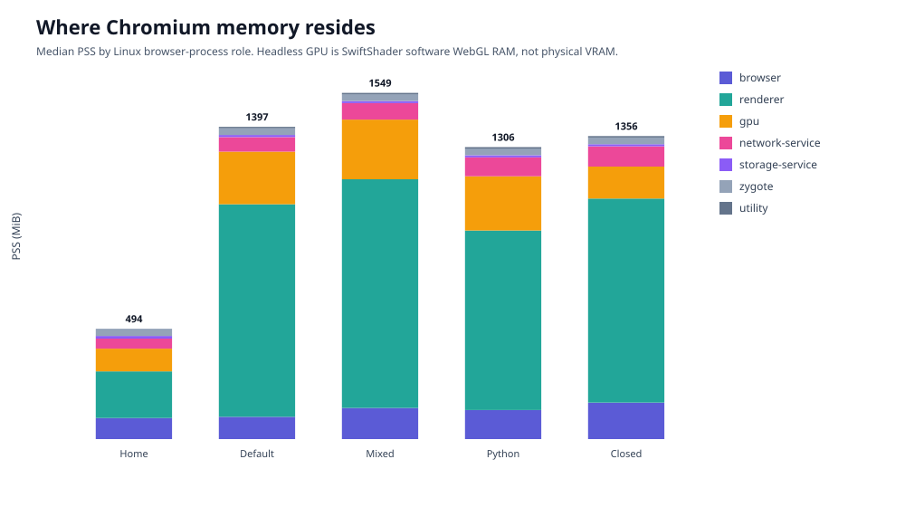
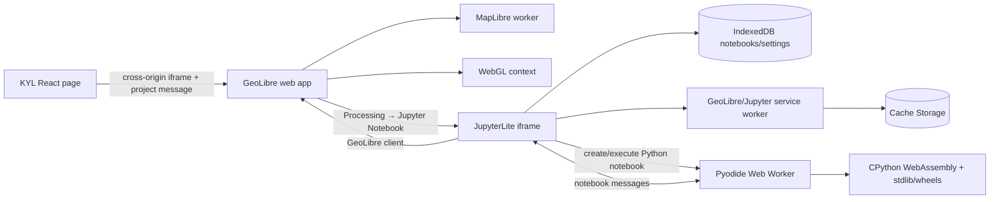
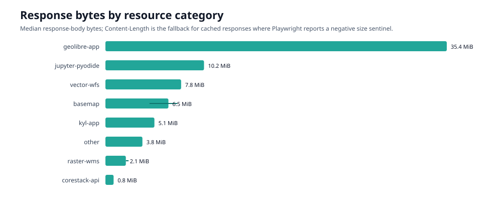

# KYL / GeoLibre Chromium memory analysis — corrected report

Date: 21 August 2026  
Status: completed Chromium analysis; Firefox intentionally stopped at the user's request

## Executive verdict

The original KiloCode reports are not reliable evidence for the questions asked. They used the wrong route, did not toggle a named raster layer, did not execute a Python cell, ran browser repeats at overlapping times, and treated unavailable cross-origin transfer sizes as zero. The corrected runner fixes each of those defects and all three fresh Chromium runs passed all 11 scenario records and all 27 assertions.

The corrected results show:

- Loading the scoped GeoLibre project is the dominant initial cost. Median Chromium process-tree proportional set size (PSS) rose from **493.5 MiB** on the fresh KYL home page to **1,388.1 MiB** with the two default GeoLibre layers.
- Three real on/off cycles of `LULC Level 1 · 2024-2025` did **not** show monotonically increasing memory. Only the first `on` caused 16 WMS requests, accounting for about **1.02 MiB**; later toggles reused browser/MapLibre caches and caused no new WMS requests.
- The browser profile's physical size did not grow during those raster cycles. That does not mean no imagery was downloaded: HTTP and decoded in-memory caches are different from origin storage reported by `navigator.storage.estimate()`.
- Python/Pyodide does **not** run continuously. Opening the project had one MapLibre worker. Opening the Jupyter panel still had one worker. Executing the first Python cell created a second, identifiable Pyodide worker in all three runs; closing the notebook removed the nested Jupyter frame and Pyodide worker.
- The notebook flow fetched/accounted for about **10.21 MiB**, including **2.86 MiB** of Pyodide WASM plus the Python standard library and wheels. No Python installation on the user's computer is involved.
- GeoLibre's origin already reported about **31.4 MB** of browser-managed storage when the notebook panel opened: roughly **20.3 MB Cache Storage** and **11.1 MB IndexedDB**. Executing `print(...)` added only about 3.6 KB of IndexedDB state.
- Removing GeoLibre removed its iframe and workers, but did not promptly return Chromium to the original process-memory baseline. Median PSS was **1,358.4 MiB** shortly after the first close and **1,750.3 MiB** after two reopen/close cycles, versus **493.5 MiB** initially. Renderer count remained three instead of returning to two. This is a repeatable **short-window retention** result, not yet proof of an indefinite leak, because post-close stabilization was only about 1.5 seconds.
- The headless test did use WebGL, but through **ANGLE + SwiftShader software Vulkan**. The measured `gpu-process` memory is system RAM used for software rendering, not physical GPU VRAM. A normal headed browser may use a hardware GPU depending on the device, driver, and browser settings.



## Provenance and validity

### Authoritative checkout

The current repository is `/home/amit-spatial/core-stack/landscape-explorer`. Testing was isolated in:

- Worktree: `/home/amit-spatial/core-stack/landscape-explorer-memory-profiling`
- Branch: `chore/kyl-memory-profiling`
- Application tree: identical to `3e2a0aeb62cb028cc39986be4712621928abbd78` (`feat/geolibre-notebooks`) plus profiling-only commits
- Production server: `http://127.0.0.1:4173`
- Browser: Playwright Chromium `149.0.7827.55`
- Browser executable: `/home/amit-spatial/.cache/ms-playwright/chromium-1228/chrome-linux64/chrome`

The optimized application build was regenerated in the profiling worktree with the current `REACT_APP_API_URL` and `REACT_APP_GEOSERVER_URL`. All three runs used these identical hashes:

| Build artifact | SHA-256 |
|---|---|
| `build/index.html` | `dedadf5ace8b94f24e3527c849717cf5ae8a9691068293b9516da855d60b1b6d` |
| `build/static/js/main.7a63c656.js` | `107ca4e2aad1cfca001c8025e38b1b653b043bf73a2c749e97eed419390832f9` |

The first attempted production build had requested `/undefined/proposed_blocks/` because the profiling worktree did not contain the ignored `.env`. It was rejected and rebuilt correctly. Separately, the current `.env` line for `REACT_APP_ORG_DASHBOARD_URL` has spaces around `=` and cannot be sourced by a shell; this did not affect the tested route, but should be fixed for reproducible deployment scripts.

The run metadata records runner commits `36632724` for run 1 and `baebc98c` for runs 2–3. These commits modify only the profiler; the production build hash is identical in all runs. Runs 2–3 report `?? artifacts/` as the only dirty state because run 1's generated evidence already existed.

### Validation result

| Evidence | Run 1 | Run 2 | Run 3 |
|---|---:|---:|---:|
| Scenario records | 11 passed | 11 passed | 11 passed |
| Assertions | 27 passed | 27 passed | 27 passed |
| Samples | 73 | 73 | 73 |
| Request records | 1,488 | 1,635 | 1,568 |
| Browser process/profile | Fresh | Fresh | Fresh |
| Execution overlap | None | None | None |

Raw evidence remains locally under `artifacts/memory/corrected/chromium-run{1,2,3}/memory-run-v2.json`. The machine-readable aggregate is [analysis-summary.json](analysis-summary.json).

## Why the original KiloCode result must be superseded

| Problem | Original behavior | Effect | Corrected behavior |
|---|---|---|---|
| Worktree/branch provenance | Artifacts were written in the primary `feat/geolibre-notebooks` checkout, not the requested profiling worktree/branch | The app commit was relevant, but the claimed test workspace was wrong | Dedicated `chore/kyl-memory-profiling` worktree and embedded provenance |
| Production environment | Bundle called `/undefined/proposed_blocks/` and fell back to an older bundled location list | Homepage selection did not represent the configured deployment | Production rebuild with current API and GeoServer endpoints |
| Route | Tested `/explore_data` | Current React route is `/download_layers`; the intended page was not tested | Tests `/download_layers` both without and with scope |
| Raster toggle | A broad `/layer|.../` selector clicked the global `LAYERS` control | It collapsed/expanded the panel; it did not prove a layer changed visibility | Targets `[data-layer-name="LULC Level 1 · 2024-2025"]` and asserts `Show layer`/`Hide layer` each cycle |
| Multiple toggles | Repeated the same global control | No raster/vector workload was demonstrated | Exact MWS, DEM, and CLART rows; visibility and no-eviction assertions |
| Notebook | Downloaded a notebook and clicked `Processing` | Never chose `Jupyter Notebook`, never created a kernel, never executed Python | Opens nested JupyterLite, runs a cell, verifies output + Idle, and verifies teardown |
| “Disk did not grow” | Read top-frame origin storage only | Ordinary HTTP cache, cross-origin GeoLibre storage, and decoded caches were omitted | Captures each frame's storage plus whole browser-profile size |
| Transfer bytes | Used top-frame `PerformanceResourceTiming` | Cross-origin sizes without Timing-Allow-Origin appeared as zero | Uses Playwright request sizes; for service-worker negative sentinels, uses response `Content-Length` and flags the fallback |
| Repeat design | Three runs per engine started at nearly the same time | RAM/network competition invalidated repeat variability | Three sequential fresh Chromium processes |
| Plot generation | Per-run plots reused the same filenames | Later runs overwrote earlier plots and report sections duplicated | One validated aggregate with median and range |
| Status | `ok` meant the callback did not throw | No target-state assertion was required | Every key UI state has an assertion; any failed assertion fails the run |

Therefore the original claims that raster toggling and notebook use did not increase memory/disk were unsupported. Those reports should be retained only as an audit trail, not used for a decision.

## Corrected scenario coverage

| Requested scenario | Corrected evidence |
|---|---|
| 1. Stabilized start | Fresh home navigation and three stable samples |
| 2. Select inputs and open KYL | Real React Select choices: Bihar → Banka → Banka; `/kyl_dashboard` asserted |
| 3. Data route | Correct `/download_layers`; no-scope guidance asserted; no GeoLibre iframe allowed |
| 4. Full project/default layers | Scoped Banka project; exact default-visible set asserted as Administrative Boundaries + Socio-Economic Profile |
| 5. Raster toggling | Exact named LULC raster, three on/off cycles, state assertion after every transition |
| 6. Mixed layers/actions | MWS vector + DEM raster + CLART raster; all visible together; zoom-to-DEM invoked; cleanup measured |
| 7. Notebook | Notebook download, Jupyter shell, Python notebook, code input, output, Idle state, panel close, frame/worker removal |
| 8. Reload | Ordinary warm reload and CDP cache-disabled reload recorded separately |
| 9. Close | Navigate home; GeoLibre iframe and workers absent |
| 10. Residual cycles | Two additional open/close cycles with memory/process samples |

## Memory results

PSS is the primary metric because it apportions shared resident pages across Chromium processes and remains additive. Chromium's own memory documentation describes PSS as the proportional share of resident size on POSIX systems: [Key Concepts in Chrome Memory](https://chromium.googlesource.com/chromium/src.git/+/refs/heads/main/docs/memory/key_concepts.md).

| Tested state | Median PSS | Three-run range | Median vs fresh home |
|---|---:|---:|---:|
| Fresh KYL home | 493.5 MiB | 492.6–495.8 | baseline |
| GeoLibre + two defaults | 1,388.1 MiB | 1,369.0–1,541.5 | +894.6 MiB |
| All three mixed layers visible | 1,531.1 MiB | 1,437.6–1,597.8 | +1,037.5 MiB |
| Notebook panel, no Python worker | 1,405.3 MiB | 1,254.3–1,435.7 | +911.8 MiB |
| Python cell executed | 1,317.2 MiB | 1,266.0–1,323.4 | +823.7 MiB |
| Cache-disabled reload | 1,666.4 MiB | 1,594.7–1,822.2 | +1,172.9 MiB |
| GeoLibre closed once | 1,358.4 MiB | 1,180.6–1,487.9 | +864.9 MiB |
| Second reopen | 1,987.4 MiB | 1,922.3–2,106.7 | +1,493.8 MiB |
| Final home after second close | 1,750.3 MiB | 1,589.7–1,923.2 | +1,256.7 MiB |

The counter-intuitive fall from “notebook panel” to “Python executed” does not mean Pyodide is free. Total process memory was moving because raster/vector allocations and Chromium caches were also being reclaimed or reclassified. The worker-state transition and network records are the reliable evidence for when Python starts; a dedicated isolated notebook-only benchmark would be required to attribute an exact Pyodide memory delta.

At fresh home, median renderer PSS was about **208.5 MiB** across two renderers. At final home it was about **1,286.9 MiB** across three renderers. In run 1, the same two heavy renderer PIDs persisted through iframe removal and both reopen cycles; their combined private memory continued to grow. The GeoLibre frame and workers were absent, so DOM removal succeeded, but process allocation was not promptly returned.

This is sufficient to prioritize lifecycle investigation, but not to call an indefinite memory leak. A follow-up should sample at 0, 5, 30, and 120 seconds after close, under both ordinary and memory-pressure conditions, then reproduce in standalone GeoLibre to separate parent-app retention from upstream retention.



## Raster on/off finding

| Cycle | Raster on median PSS | Raster off median PSS | New WMS requests on `on` |
|---|---:|---:|---:|
| 1 | 1,353.9 MiB | 1,312.6 MiB | 16 (~1.02 MiB) |
| 2 | 1,317.9 MiB | 1,216.9 MiB | 0 |
| 3 | 1,309.8 MiB | 1,247.3 MiB | 0 |

The sequence does not grow monotonically, and toggling off generally reduces PSS after the short settle. Subsequent `on` actions perform no network fetch because the raster tiles remain cached. The whole browser profile was effectively flat during these six transitions.

This answers the original question: a raster can consume decoded image/WebGL memory without causing a visible persistent-disk increase at every toggle. “No disk change” is expected on cached re-use and is not proof that the layer did no work.

## Notebook and Python architecture

GeoLibre documents that its web notebook is JupyterLite with a Pyodide kernel, while desktop builds use a JupyterLab server: [GeoLibre features](https://geolibre.app/features/). JupyterLite is a static, browser-hosted Jupyter implementation with kernels running in Web Workers and files stored in IndexedDB/local storage; it needs no host-side Jupyter server: [JupyterLite documentation](https://jupyterlite.readthedocs.io/en/stable/). The Pyodide kernel is explicitly browser-based and worker-isolated: [JupyterLite kernels](https://jupyterlite.readthedocs.io/en/stable/howto/configure/kernels.html).



Observed lifecycle in every corrected run:

| State | Frames | Workers | Python status |
|---|---:|---:|---|
| Scoped GeoLibre project | KYL + GeoLibre | 1 MapLibre | not loaded |
| Jupyter panel open | KYL + GeoLibre + JupyterLite | 1 MapLibre | no Pyodide worker |
| First cell executed | KYL + GeoLibre + JupyterLite | MapLibre + Pyodide | `Python (Pyodide) \| Idle` after output |
| Notebook closed | KYL + GeoLibre | 1 MapLibre | Jupyter frame and Pyodide worker gone |
| GeoLibre route closed | KYL only | 0 | none |

Only a 325-byte `pyodide-config` module appeared during ordinary GeoLibre loading. The WASM, standard library, wheels, and Pyodide worker appeared during actual notebook execution.

### Package management for browser-only users

Users do not need Python, `pip`, or `uv` installed on their computers. The browser downloads a WebAssembly CPython runtime and compatible packages. In the GeoLibre Python Console, the documented API is `await geolibre.load_package("numpy")`; in JupyterLite notebooks, `%pip install package` is routed through JupyterLite/Pyodide package tooling. `micropip.install(...)` is also available.

This is not a normal desktop Linux Python environment:

- `uv` is not the browser environment manager and should not be presented as the notebook installation path.
- Pure-Python wheels can generally be downloaded from PyPI.
- Packages with native C/Rust extensions need a Pyodide/Emscripten-compatible build; ordinary Linux/macOS/Windows wheels cannot run in the WASM kernel.
- Network requests must satisfy browser CORS/content-security policy.
- Browser storage/cache, not a system virtual environment, holds notebooks and cached packages.

See [GeoLibre Python Console: Loading more packages](https://geolibre.app/user-guide/python-console/#loading-more-packages), [micropip API](https://micropip.pyodide.org/en/latest/project/api.html), and [JupyterLite troubleshooting: WebAssembly package compatibility](https://jupyterlite.readthedocs.io/en/stable/troubleshooting.html#package-compatibility-with-webassembly-kernels).

JupyterLite's service worker can cache the app, files, and package requests for offline use: [Service Worker documentation](https://jupyterlite.readthedocs.io/en/stable/howto/configure/advanced/service-worker.html). That matches the observed service-worker responses and explains why fresh execution did not map neatly to physical profile growth.

## Network and storage



Median accounted response bytes for the full scenario sequence:

| Category | Median |
|---|---:|
| GeoLibre app/assets | 35.36 MiB |
| Jupyter/Pyodide | 10.21 MiB |
| Vector WFS | 7.84 MiB |
| Basemap | 6.53 MiB |
| KYL app | 5.08 MiB |
| Other | 3.83 MiB |
| Raster WMS | 2.12 MiB |
| CoRE Stack API | 0.85 MiB |

For 939–957 cached/service-worker records per run, Playwright returned a negative response-body sentinel. The analyzer substitutes the response's `Content-Length` for those records and preserves the count in `analysis-summary.json`. These values are accounted transfer/resource sizes, not a claim of unique cold-network traffic: service workers and cache reuse can satisfy requests without a wire transfer.

## WebGL/GPU interpretation

All three runs reported:

```text
ANGLE (Google, Vulkan 1.3.0 (SwiftShader Device (Subzero)), SwiftShader driver)
```

The Chromium command line also contained `--use-angle=swiftshader-webgl` and `--enable-unsafe-swiftshader`. Therefore:

- GeoLibre/MapLibre used a WebGL rendering context.
- The headless test's GPU process used software rendering in system RAM.
- The `gpu-process` PSS values must not be described as GPU VRAM.
- A browser can keep a GPU process even before GeoLibre opens; process existence does not prove continuous map rendering.
- Whether a real user's browser uses a physical GPU depends on headed Chromium, hardware acceleration, drivers, and policy. That needs a separate headed measurement (`chrome://gpu` plus browser task manager/OS GPU counters).

Each run emitted four SwiftShader `GPU stall due to ReadPixels` warnings. The GeoLibre load also emitted **25 “Multiple instances of Three.js being imported” warnings per run**. These warnings are reproducible and worth upstream investigation, but the current data does not quantify their independent memory contribution.

## Other runtime errors

The notebook loaded and executed successfully, but each run logged two Jupyter bundle errors:

- Module Federation `RUNTIME-012`: shared module getter is not a function for `@jupyterlab/docregistry`.
- `ReferenceError: Cannot access 'x' before initialization` in the Jupyter notebook lab extension.

Runs 1–2 also logged failed Google basemap tile fetches while the iframe was being closed. These occurred after teardown started and did not fail the state assertions. The parent page emitted one unhelpful `pageerror` whose value was literally `undefined` at startup in every run; the app should log a real `Error` object or message so this can be traced.

## Recommendations

### Priority 0 — establish ownership of retained memory

1. Add one diagnostic test with post-close samples at 0, 5, 30, and 120 seconds. Do not interact during cooldown. Record PSS/private memory per PID and whether renderer PIDs exit.
2. Run the same project directly in standalone `web.geolibre.app`, then close/reopen it using only GeoLibre controls. Compare with the KYL iframe flow. This separates GeoLibre retention from the parent React renderer and Chromium process caching.
3. Repeat once in headed Chromium with the machine's real GPU. Keep the current SwiftShader result as a deterministic CI benchmark, not a hardware-GPU claim.
4. Pin an exact GeoLibre deployment/build identifier. The current integration targets an unversioned `https://web.geolibre.app/` URL while local compatibility configuration says 2.6.0; upstream changes can otherwise alter results without a KYL commit.

### Priority 1 — controls we can implement in KYL

1. Keep the current lazy route behavior: do not mount GeoLibre until a location exists. Scenario 3 confirms this works.
2. Before unmounting the iframe, request an upstream `dispose` operation and wait for acknowledgement. It should close notebook kernels, terminate workers, remove the MapLibre map/WebGL context, revoke object URLs, release large project buffers, and detach observers/listeners. Until GeoLibre exposes this, iframe removal is the only hard boundary available to KYL.
3. Provide a visible **Unload map and free resources** action. If memory remains high after an acknowledged dispose, offer a hard page reload as a documented fallback.
4. Retain the explicit notebook close control and teach users to use it. It demonstrably destroys the Pyodide worker; merely leaving a cell idle does not.
5. Add a visible-layer budget/warning for large vector and raster combinations. Do not silently evict layers; explain the cost and let users unload them deliberately.
6. Reduce large WFS payload expansion. Prefer vector tiles/PMTiles, simplified geometries by zoom, server-side filters, pagination, and compressed responses. The 7.84 MiB WFS payload can occupy far more memory after JSON parsing, geometry creation, indices, and rendering buffers.
7. Add opt-in diagnostics showing iframe state, worker count, visible-layer count, loaded feature count, last resource errors, and GeoLibre build ID. This will make future support reports reproducible.

### Priority 2 — recommendations for GeoLibre

1. Publish an embed lifecycle contract: `ready`, `loadProject`, `dispose`, `disposed`, and a diagnostics response. `dispose` should be idempotent and release all workers, kernels, WebGL maps/contexts, SQL/WASM engines, observers, event listeners, ArrayBuffers, and object URLs.
2. Investigate renderer/private-memory retention across repeated embed open/close cycles with a long cooldown and Chrome memory-infra tracing.
3. Deduplicate Three.js in the production bundle; 25 warnings on each load indicates repeated runtime instances or federated chunks.
4. Fix the Jupyter Module Federation `@jupyterlab/docregistry` mismatch and initialization `ReferenceError`, even though a simple cell currently runs.
5. Expose notebook kernel state and a **Shutdown kernel and close** action separately from hiding the panel.
6. Expose whether rendering is hardware or software and offer reduced-rendering controls for constrained devices.
7. Document cache/storage clearing and package-cache behavior in the Notebook panel. JupyterLite already provides browser-data clearing, but users need to understand its scope and consequences.

## What not to conclude

- Do not quote the old Firefox results. Firefox was not rerun to completion after the user requested Chromium-only reporting.
- Do not claim 1.75 GiB is an indefinite leak; it is retained memory within a short post-close window.
- Do not add frame heap numbers together indiscriminately; Chromium's process-level PSS/private metrics are the primary evidence.
- Do not interpret constant profile size as “no downloads” or “no cache.”
- Do not interpret the headless `gpu-process` as physical GPU utilization or VRAM.
- Do not assume every PyPI package works in Pyodide.

## Reproduction

```bash
cd /home/amit-spatial/core-stack/landscape-explorer-memory-profiling

# Serve the already-built production app.
node /home/amit-spatial/.npm/_npx/aab42732f01924e5/node_modules/serve/build/main.js \
  -s build -l tcp://127.0.0.1:4173

# In another terminal, run one fresh Chromium profile.
node scripts/memory/kyl-memory-profile.mjs \
  --engine=chromium \
  --url=http://127.0.0.1:4173/ \
  --out=artifacts/memory/corrected/chromium-run4 \
  --settleMs=1000 \
  --stableIntervalMs=750

# Regenerate the validated aggregate from the three accepted runs.
python3 scripts/memory/analyze-kyl-memory.py \
  --output artifacts/memory/report-validation-corrected \
  artifacts/memory/corrected/chromium-run1/memory-run-v2.json \
  artifacts/memory/corrected/chromium-run2/memory-run-v2.json \
  artifacts/memory/corrected/chromium-run3/memory-run-v2.json
```

The upstream-ready drafts are in [GEOLIBRE_ISSUE_DRAFT.md](GEOLIBRE_ISSUE_DRAFT.md).
