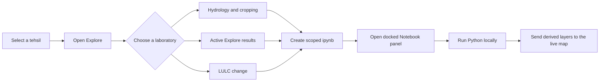
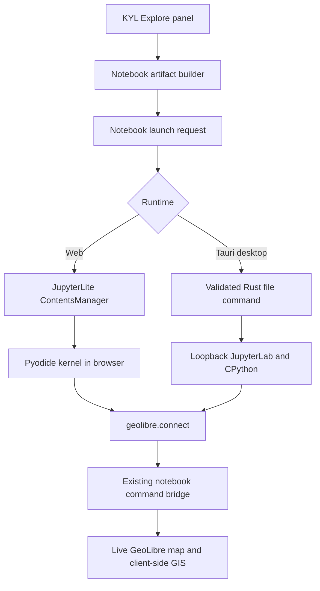

# Notebook-backed Explore

CoRE-GeoStack treats Python notebooks as an execution surface of the same KYL
workspace, not as files linked from a separate learning portal. A notebook is
generated from the active state, district, tehsil, selected layers, selected
Explore filters, and LULC comparison years.

## User flow



There is no download-upload step. The generated notebook is visible immediately
in the resizable panel beside the map.

## Runtime architecture



The web build saves the notebook through JupyterLite's same-origin
`ContentsManager` and opens it with JupyterLab's document command. The desktop
build invokes `save_jupyter_notebook`; Rust accepts only a flat ASCII
`.ipynb` filename and writes inside the app-data notebook directory. The
loopback Jupyter server remains token-protected.

Both runtimes import the bundled `geolibre` notebook client. Cells can move the
camera, add derived GeoJSON, change styles and visibility, and run supported
client-side algorithms against the map already visible beside the notebook.

## Included laboratories

### Hydrology and cropping

- reads the public tehsil MWS indicator and WFS geometry endpoints;
- inventories live indicator/year families instead of assuming one schema;
- selects an MWS and adds its polygon back to the map;
- plots available groundwater, well-depth, and cropping series;
- exports session GeoJSON and CSV; and
- keeps the richer authenticated profile request optional and runtime-only.

### Reproduce active Explore filters

- embeds the selected KYL filter definitions and current result counts;
- fetches the same source records when the cell runs;
- reproduces OR-within-indicator and AND-across-indicators filtering; and
- exposes ordinary Python records for extensions and CSV export.

### LULC change

- records exact Level 1, 2, or 3 WMS layers and selected years;
- opens alongside a native synchronized two-map comparison; and
- provides repeatable WMS point inspection and JSON export.

## LULC split view

The **Compare maps** action loads only the selected earlier and later rasters,
creates GeoLibre's native `1 × 2` map grid, synchronizes the camera, and applies
per-pane visibility overrides. Administrative Boundaries remain available as
context. **Return to one map** collapses the grid and leaves the later year as
the active LULC layer.

## Data and credential boundary

- Published GeoServer and KYL sources are read-only.
- Computation runs in the user's browser or desktop Python environment.
- Derived layers and exports remain in the user's session.
- No API credential is generated into a notebook or frontend environment.
- Optional API cells read `CS_API` or `CORESTACK_API_KEY` only at execution
  time, including Colab Secrets and a hidden prompt.

## Local review with the legacy demo

The two apps use separate worktrees and ports:

```bash
# Existing KYL /download_layers integration
cd /mnt/y/core-stack-org/landscape-explorer
HOST=127.0.0.1 PORT=3000 BROWSER=none npm start

# Native CoRE-GeoStack worktree
cd /mnt/y/core-stack-org/landscape-explorer-core-geostack-notebooks
npm run build
npm start
```

Open the legacy demo at <http://127.0.0.1:3000/download_layers> and the native
app at <http://127.0.0.1:4173/?mode=explore>.
