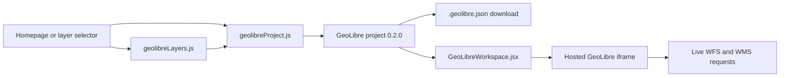

# KYL GeoLibre integration

This directory contains the Know Your Landscape (KYL) integration with
[GeoLibre](https://github.com/opengeos/GeoLibre). It builds portable
`.geolibre.json` projects for a selected tehsil and can load the same project
directly into the hosted GeoLibre workspace.

The project files contain layer configuration, styling, and live GeoServer
references. They do not embed copies of feature data. The runtime integration
is entirely under `src/`; files under `.local/geolibre/` are prototypes and are
not application dependencies.

## User entry points

- The KYL home page can open a full tehsil project or download its project JSON.
- The `/download_layers` page lets users select layers by domain and choose
  individual LULC years before opening or downloading the project.
- The embedded workspace includes a second project-download action and returns
  to KYL without navigating away from the application.

## Architecture



| File | Responsibility |
|---|---|
| `../../config/geolibreLayers.js` | Shared domain catalog, layer names, GeoServer workspaces, LULC years, named WMS styles, and original QML URLs |
| `geolibreProject.js` | Location normalization, live source construction, QML-derived vector styles, project assembly, and JSON download |
| `GeoLibreWorkspace.jsx` | Full-screen iframe, trusted-origin embed handshake, project loading, and workspace controls |
| `geolibreProject.test.js` | Project contract, catalog coverage, live-reference shape, style metadata, and input validation |

The current catalog contains 24 layer choices across Land, Climate, Hydrology,
Agriculture, Restoration, NREGA, and Demographic groups.

## Project and data contract

`buildGeoLibreProject` produces GeoLibre project format `0.2.0` with:

- normalized `district_tehsil` GeoServer layer names;
- layer groups matching the KYL domains;
- the current map center and zoom when launched from `/download_layers`;
- live URL-backed layers rather than embedded `FeatureCollection` objects;
- a five-minute refresh hint for vector sources;
- the original QML URL and GeoServer source details in each layer's metadata;
- KYL scope metadata for state, district, and tehsil; and
- legend, basemap, and project preferences required by GeoLibre.

Vector layers use WFS GeoJSON URLs and GeoLibre's URL-backed vector restore
state. Raster layers use tiled WMS requests. Raster metadata also carries a WCS
GetCoverage URL for the underlying GeoTIFF where the GeoServer workspace
supports it.

## Styling Rules

GeoLibre does not load a remote QML URL as a project style automatically. The
integration therefore handles styles according to source type:

- **Vector layers:** the relevant QML symbology is represented as a GeoLibre
  single, categorized, or expression style in `STYLE_PROFILES`. The equivalent
  restore style is persisted in `metadata.vectorState.style` so it survives
  project loading. The original QML URL remains in
  `metadata.corestack.qmlStyleUrl` for inspection or reuse.
- **Raster layers:** GeoServer renders the named WMS style specified by
  `wmsStyle` in the catalog. The original raster QML URL is also retained in
  metadata.

When a QML file changes, update the corresponding vector style profile or
published GeoServer WMS style as appropriate. Merely changing `qmlStyleUrl`
does not change rendered symbology.

## Public API

```js
import {
  buildGeoLibreProject,
  downloadGeoLibreProject,
  selectedGeoLibreLayerIds,
} from "./geolibreProject";

const years = {
  lulc_level_1: "24_25",
  lulc_level_2: null,
  lulc_level_3: "24_25",
};

const selectedLayerIds = selectedGeoLibreLayerIds({
  toggledLayers,
  years,
});

const project = buildGeoLibreProject({
  state: "Assam",
  district: "Cachar",
  tehsil: "Lakhipur",
  selectedLayerIds,
  years,
  mapView: { center: [93.04, 24.84], zoom: 10 },
});

downloadGeoLibreProject(project);
```

Required inputs are `state`, `district`, `tehsil`, and at least one valid layer
ID. A year-based layer is omitted when its year is empty.

## Configuration

The defaults can be overridden with Create React App build-time environment
variables:

```dotenv
REACT_APP_GEOLIBRE_URL=https://web.geolibre.app/
REACT_APP_GEOSERVER_URL=https://geoserver.core-stack.org:8443/geoserver/
```

Restart the development server after changing either value. A custom GeoLibre
deployment must support the embed bridge and permit iframe embedding.

## Embed bridge

`GeoLibreWorkspace` opens the viewer with `embed=1&welcome=0` and waits for:

```text
geolibre:ready
```

It then sends:

```text
geolibre:load-project
```

Messages are accepted only when both the sender window and sender origin match
the configured viewer. The component also restores page scrolling on close and
supports the Escape key.

## Adding or changing a layer

1. Add or update the layer in `../../config/geolibreLayers.js`.
2. Use the existing UI/map toggle name as both `id` and `name` where possible.
3. Define its `workspace`, `sourceType`, and `layerName` function.
4. For WFS, set `geometryType`, `styleProfile`, and `qmlStyleUrl`.
5. For WMS, set the published `wmsStyle` and `qmlStyleUrl`.
6. Add or update the vector profile in `STYLE_PROFILES` when QML symbology must
   be translated.
7. Extend `geolibreProject.test.js` when the source or style contract introduces
   a new case.
8. Verify the generated URL against a representative tehsil before merging.

Do not put feature arrays in the project. Keeping sources live makes the JSON
small and avoids stale static tehsil exports.

## Development and validation

Run the focused tests:

```bash
CI=true npm test -- --watchAll=false src/components/geolibre/geolibreProject.test.js
```

Run targeted linting:

```bash
npx eslint \
  src/config/geolibreLayers.js \
  src/components/geolibre/GeoLibreWorkspace.jsx \
  src/components/geolibre/geolibreProject.js \
  src/components/geolibre/geolibreProject.test.js
```

Build the application:

```bash
npm run build
```

Start a local demo:

```bash
HOST=0.0.0.0 PORT=3000 BROWSER=none npm start
```

Then open <http://localhost:3000>, select a state, district, and tehsil, and use
either **Open GeoLibre** or **Choose Layers**.

Live validation should confirm, for a representative tehsil:

- each WFS URL returns GeoJSON;
- each WMS layer and named style returns an image;
- every QML URL is reachable;
- the hosted viewer is reachable and can be framed;
- the generated JSON contains no `features` array; and
- downloaded files end in `.geolibre.json`.

## Troubleshooting

- **The Open/Download buttons are disabled:** select state, district, tehsil,
  and at least one layer. A selected LULC layer also needs a year.
- **A vector layer does not load:** check the normalized GeoServer layer name,
  WFS response, browser CORS response, and geometry type.
- **A raster is blank:** verify the coverage exists and that its named WMS style
  is published in the configured workspace.
- **The iframe stays empty:** check the viewer URL, iframe policy, browser
  console, and whether `geolibre:ready` is received from the configured origin.
- **A style differs from QGIS:** compare the QML with its `STYLE_PROFILES` entry
  for vectors or the published GeoServer style for rasters.

